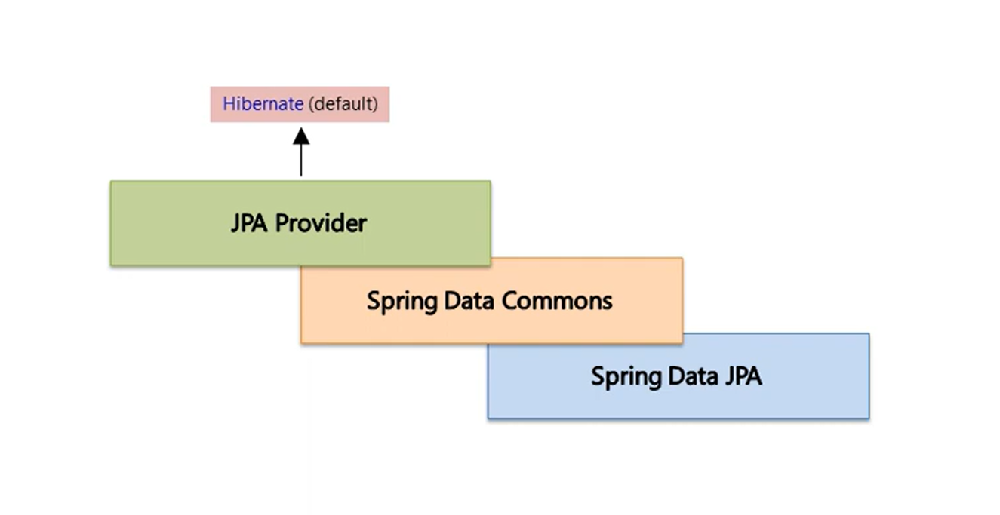
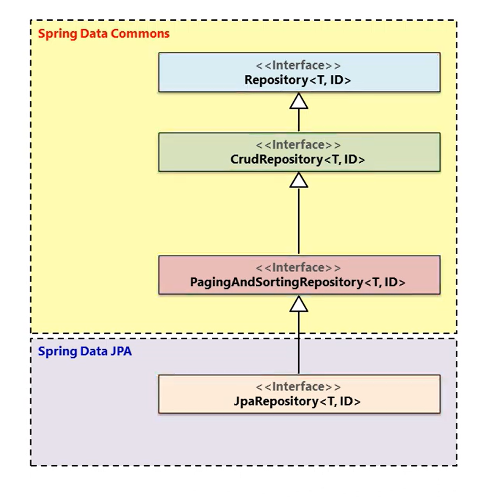
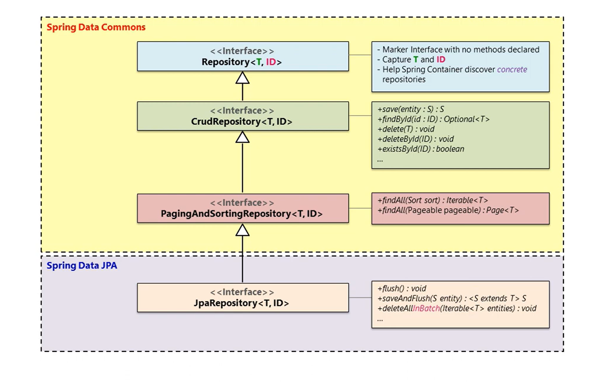
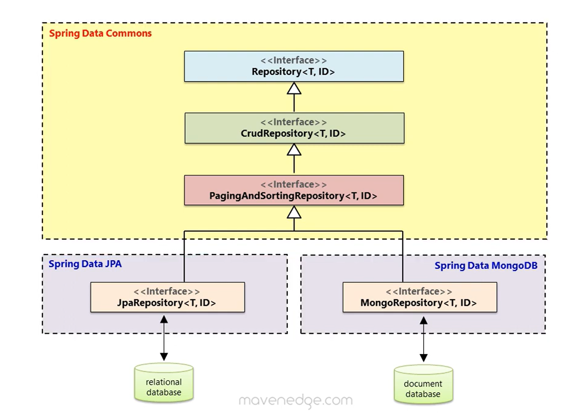
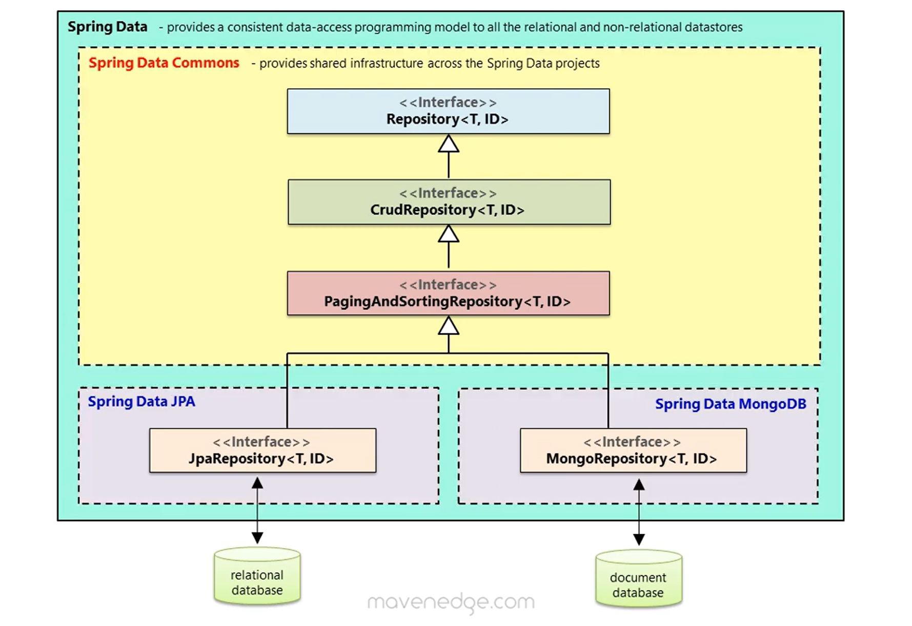

# Spring Data JPA

## Architecture Diagrams of Spring Data

<table align="center" border="1" cellpadding="8">
    <tr>
       <td align="center">
            
             
            <em>Figure 1: Spring Data JPA using Hibernate as default JPA Provider</em>
        </td>
    </tr>
    <tr>
       <td align="center">
            
             
            <em>Figure 2: Interface hierarchy b/w Spring Data Commons & Spring Data JPA modules</em>
        </td>
    </tr>
    <tr>
       <td align="center">
            
             
            <em>Figure 3: Interface methods in Spring Data Commons & Spring Data JPA modules</em>
        </td>
    </tr>
    <tr>
       <td align="center">
            
             
            <em>Figure 4: Spring Data modules JPA and Mongodb</em>
        </td>
    </tr>
    <tr>
       <td align="center">
            
             
            <em>Figure 5: Spring Data modules - Architecture</em>
        </td>
    </tr>
</table>

